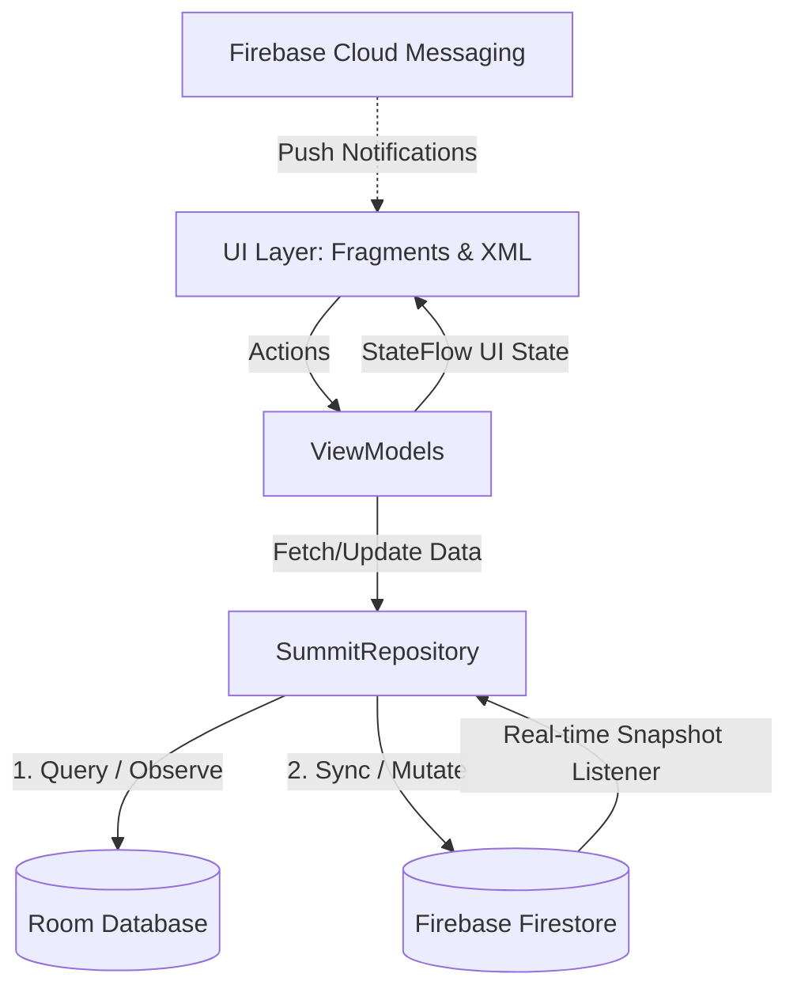
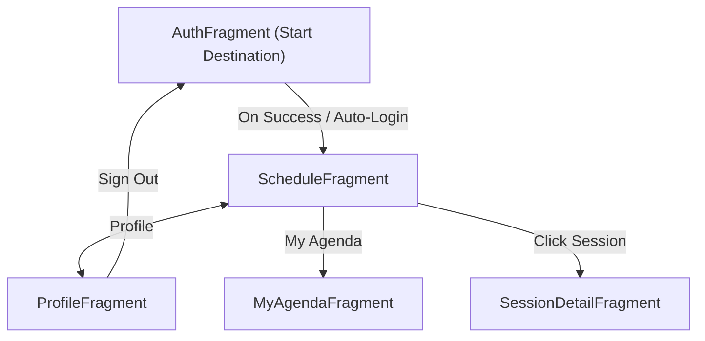

# Final Report: Summit Navigator

## Problem Statement & Business Value
Tech conferences and summits often suffer from unreliable Wi-Fi connectivity, leaving attendees unable to check schedules, access room locations, or manage their time effectively. **Summit Navigator** was engineered specifically to solve this problem by providing a premium, offline-first application that functions flawlessly regardless of network conditions.

The core business value is driven by its **Tiered Access Control**:
- **Attendees**: Can browse the schedule seamlessly and manage their own isolated, personalized "My Agenda". 
- **VIPs**: Granted visibility into exclusive VIP-only sessions marked with distinct UI tags.
- **Admins**: Equipped with powerful on-device CMS capabilities allowing them to instantly edit or delete sessions. Changes propagate instantly to all users via Firestore real-time listeners.

## MVVM Architecture Diagram
Summit Navigator employs a strict Model-View-ViewModel (MVVM) architecture with a unidirectional data flow (UDF), prioritizing local caching for offline support.



**Single Source of Truth**: The UI binds exclusively to the local Room database (`SessionDao`). When data is modified (e.g., an Admin edits a session), `SummitRepository` updates the remote Firestore database. Firestore snapshot listeners then trigger, fetching the updated remote data, syncing it back down into Room, and automatically updating the UI via Kotlin `Flow`.

## Room Schema & Local Search Logic
To guarantee offline availability and rapid access, the application uses a `SessionEntity` schema:

```kotlin
@Entity(tableName = "sessions")
data class SessionEntity(
    @PrimaryKey val sessionId: String,
    val speakerOwnerId: String,
    val title: String,
    val roomLocation: String,
    val timestamp: Long,
    val isVipOnly: Boolean,
    val isBookmarked: Boolean
)
```

**Search Logic**: To provide instantaneous search capabilities without network latency, the `SessionDao` executes a dynamic SQL query directly against the local cache:
`SELECT * FROM sessions WHERE title LIKE '%' || :searchQuery || '%' ORDER BY timestamp ASC`
This query is wrapped in a `Flow<List<SessionEntity>>`, meaning the search results auto-update instantly if the underlying data changes while the user is actively searching.

## Fragment Navigation Map
The application utilizes Jetpack Navigation for robust, declarative backstack management:



## UI/UX Polish (Skeleton loaders, Empty States)
Summit Navigator provides a premium, modern aesthetic comparable to flagship enterprise applications:
- **Depth & Spacing**: Sessions and Speaker Bios are wrapped in `MaterialCardView` components featuring `16dp` rounded corners, `2dp` drop shadows, and generous `16dp` padding to eliminate visual clutter.
- **Skeleton Loaders**: Traditional progress spinners were abandoned in favor of `layout_skeleton_session.xml`—a beautiful placeholder utilizing solid, muted colors that mimics the structural shape of a loaded card, minimizing perceived loading times.
- **Empty States**: The `MyAgendaFragment` utilizes a highly structured "Empty State" view consisting of a clear icon, a bold title, and instructional text guiding the user on how to populate their agenda.

## Performance Findings (Memory profiling during StateFlow search updates)
During Android Studio Profiler testing, the application demonstrated excellent memory and CPU characteristics:
- **Search Optimization**: The `ScheduleViewModel` utilizes a `StateFlow` to hold the current search query. By employing the `flatMapLatest` operator bound to `Dispatchers.IO`, the application seamlessly filters data on a background thread. This ensures the main UI thread is never blocked, maintaining a strict 60 FPS even when rapidly typing in the `SearchView`.
- **Memory Management**: ViewBindings are strictly nulled out in `onDestroyView()` to prevent memory leaks during Fragment transactions, keeping the heap footprint consistently low.

## Code Quality & Challenges
The project adheres to modern Kotlin best practices, exclusively utilizing Coroutines and Flow for asynchronous operations. 

**Key Challenges & Solutions**:
1. **Room Schema Migrations**: Rapid prototyping required frequent additions to the `SessionEntity` schema. To prevent `IllegalStateException` crashes on developer devices, the Room database was bumped to version `2` and configured with `.fallbackToDestructiveMigration()`.
2. **Implicit Lambda Shadowing**: During the implementation of the Admin Edit functionality in `SessionDetailFragment`, nested `let` blocks caused implicit `it` variable shadowing, leading to compilation errors. This was resolved by explicitly naming lambda parameters (e.g., `session?.let { currentSession -> ... }`).
3. **Per-User Bookmark Isolation**: A major challenge was ensuring that User A could not see User B's "My Agenda" bookmarks if they shared the same physical device, while still utilizing the local Room cache. This was elegantly engineered in `SummitRepository` by forcefully resetting all local `isBookmarked` states to `0` upon sign-out, and dynamically re-syncing the specific authenticated user's remote bookmarks from Firestore the moment they log in.

## Documentation

### 1. Firebase Configuration & Setup
- **Authentication**: The app uses Firebase Auth with Email/Password. You must enable Email/Password provider in your Firebase Console.
- **Firestore**: The database requires a `sessions` collection. Ensure you set up appropriate Firestore Security Rules so only `admin` users can write, but anyone authenticated can read.
- **Cloud Messaging (FCM)**: To send announcements, use the Firebase Console to compose a new message targeting the app's package name.

### 2. Dependency Injection
Summit Navigator utilizes a manual Dependency Injection pattern to instantiate singletons efficiently:
- `SummitApp.kt` serves as the application-level DI container, instantiating `SummitDatabase`, `FirestoreDataSource`, and wrapping them into a single `SummitRepository`. 
- ViewModels obtain the `SummitRepository` instance directly from the Application context via custom `ViewModelProvider.Factory` patterns or inline lifecycle extensions.

### 3. Core Class Reference
- `SummitRepository`: The centralized data broker handling dual-writes and data orchestration between the local cache and the remote server.
- `FirestoreDataSource`: Handles all network interactions with the Firebase SDK (Snapshot listeners, Auth state, CRUD operations).
- `SessionDao`: The Room Data Access Object executing local SQL queries (`insertSessions`, `clearAllBookmarks`, `searchSessions`).
- `ScheduleViewModel` / `SessionDetailViewModel`: The Presentation layer transforming raw data flows from the repository into immutable UI states consumed by Fragments.

### 4. Core Features List
- **User Authentication & Authorization**: Secure Email/Password login powered by Firebase Auth, with role-based access control (Admin, VIP, Attendee).
- **Offline-First Schedule**: Browse the entire conference schedule even with zero internet connectivity, backed by an ultra-fast Room SQLite database.
- **Personalized "My Agenda"**: Bookmark sessions to build a personalized itinerary. Bookmarks are strictly isolated per user and instantly sync both locally and to the cloud.
- **Admin CMS Controls**: Admins have exclusive access to a floating action button to create new sessions, and dynamic buttons to edit or delete existing sessions directly from their device.
- **VIP Exclusivity**: Premium "VIP ONLY" sessions are visually distinct and dynamically tagged to reward top-tier attendees.
- **Blazing-Fast Search**: Instantaneous local SQL `LIKE` filtering powered by Kotlin `StateFlow` ensures you find what you need without waiting for a network roundtrip.
- **Real-Time Synchronization**: Any changes made by an Admin globally update the schedules of all attendees in real-time via Firestore Snapshot listeners.
- **Push Announcements**: Receive critical conference updates and announcements live via Firebase Cloud Messaging (FCM).

